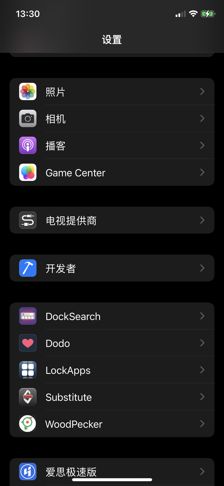
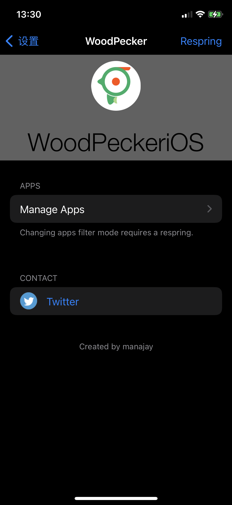
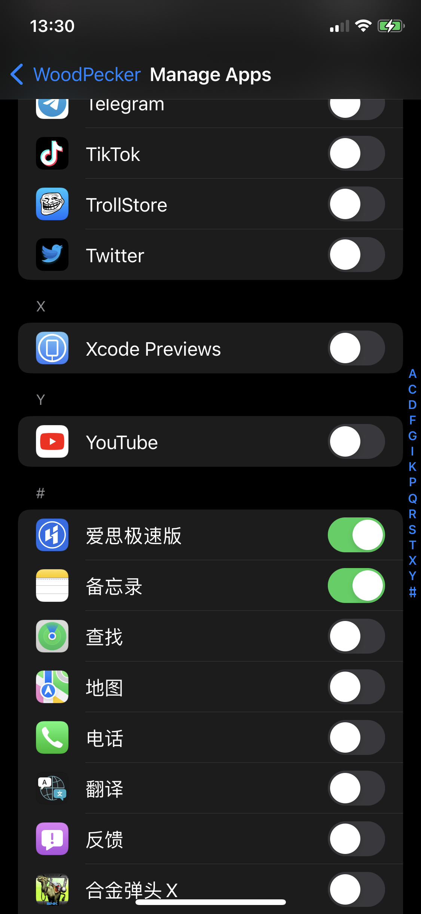

# WoodPecker iOS Jailbreak Tweak

WoodPeckeriOS 可以在越狱设备上动态加载 WoodPeckeriOS.framework 到任意应用中，以使用 WoodPeckeriOS 进行应用内调试。

关于 WoodPeckeriOS 可以参考[它的项目主页](https://github.com/appwoodpecker/woodpecker-ios)。

### 手动安装

将本项目 clone 到本地，修改 Makefile 中的设备 IP 和 PORT，然后执行 `make package install` 即可。

执行的前提是 
1. thoes 本地的安装路径
2. USB 连接越狱设备: `iproxy 2222 22`
3. 具体功能是先生成 dylib动态库, 再加上 plist 配置, 生成 deb 文件, 然后安装到 iOS 设备上
4. 注意动态库的签名 问题导致 dlopen 失败的问题

## issue

- 签名问题

```
Load WoodPeckeriOS dylib fail: dlopen(/Library/Application Support/TSWoodPeckeriOSLoader/WoodPeckeriOS.framework/WoodPeckeriOS, 2): no suitable image found.  Did find:
	/Library/Application Support/TSWoodPeckeriOSLoader/WoodPeckeriOS.framework/WoodPeckeriOS: code signature in (/Library/Application Support/TSWoodPeckeriOSLoader/WoodPeckeriOS.framework/WoodPeckeriOS) not valid for use in process using Library Validation: mapped file has no cdhash, completely unsigned? Code has to be at least ad-hoc signed.
```

查看 打包的动态库签名 

```
codesign -d -vv ./layout/Library/Application\ Support/TSWoodPeckeriOSLoader/WoodPeckeriOS.framework
```

重签名

```
codesign -fs "Apple Development: ljduan2013@icloud.com (992QNX5ZG6)" ./layout/Library/Application\ Support/TSWoodPeckeriOSLoader/WoodPeckeriOS.framework
```

偶尔出现 签名问题后, 重复几次又好了, 具体原因还不太明白, 有了解的, 还望不吝赐教. 直接发邮件到 [mailto://me@todayios.com](mailto://me@todayios.com)

## 使用

在系统设置界面中找到 TSWoodPeckeriOSLoader，选择要你想要调试的程序打开开关。

启动对应的应用，查看 Mac 端的 Woodpecker 是否显示应用首页, 如果不显示, 可以在应用首页双指长按, 调出搜索 服务页面 ,如果还不出现, 大概率是因为动态库的签名导致

如果

## 效果





